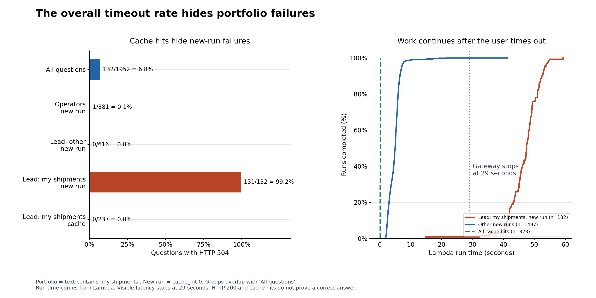
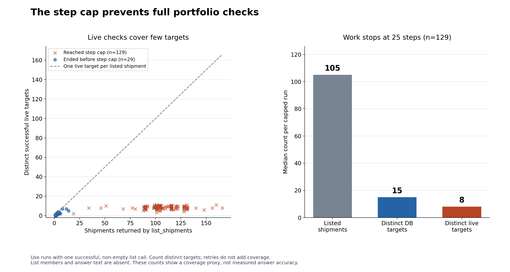
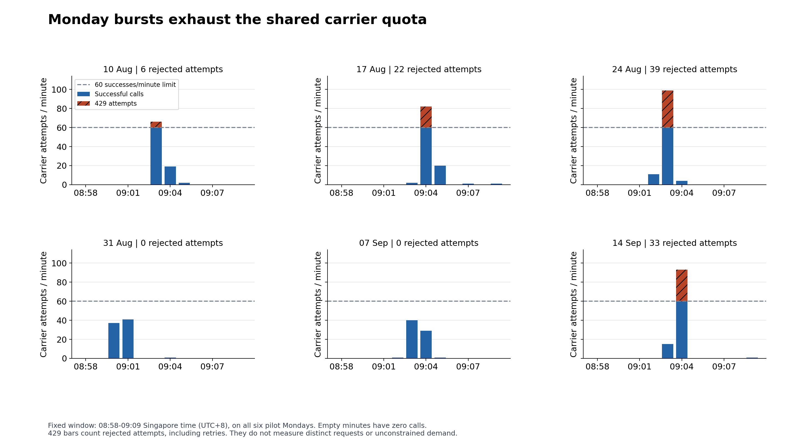
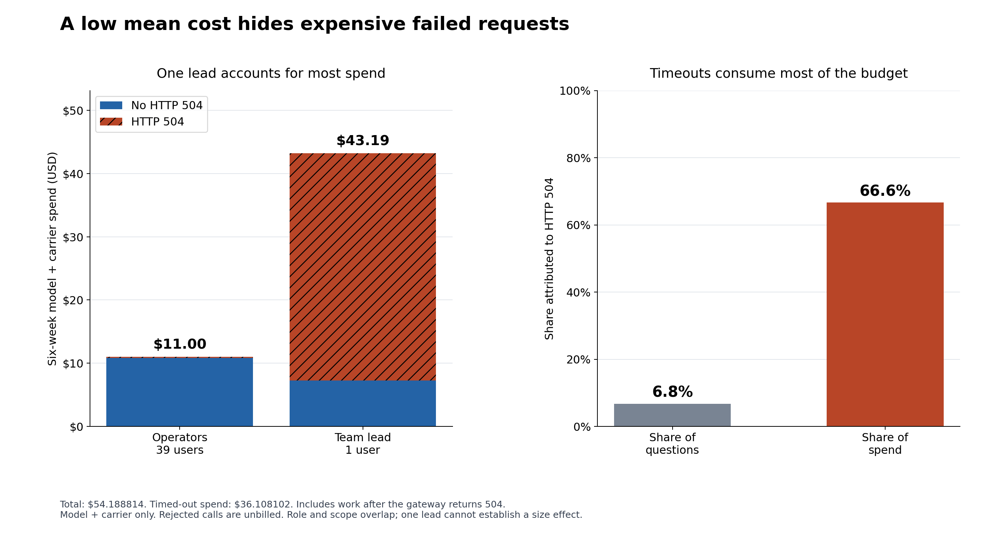
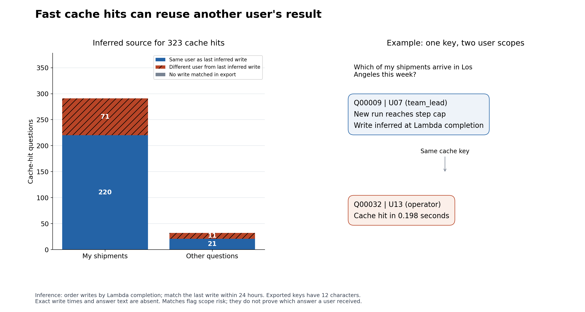
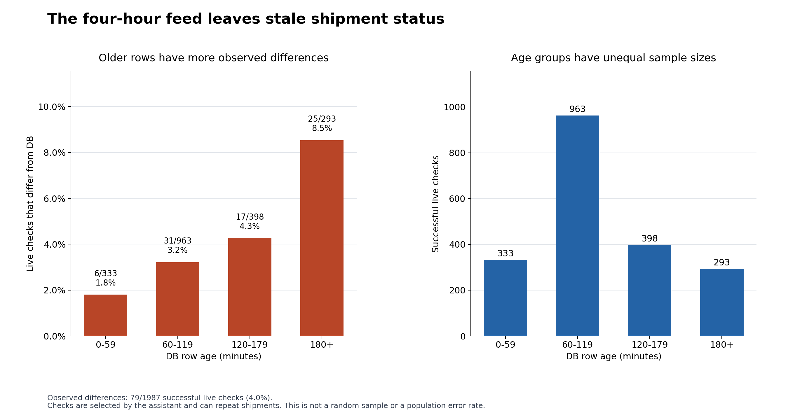

# Pilot issue analysis

The six-week pilot contains 1,952 questions. It has one team lead and 39 operators.
The overall timeout rate is 6.8%. The mean question cost is $0.0278.
These means hide the failures below. These charts show observed pilot work. They do not project capacity at fifty customers.

| Issue | Evidence | Interpretation |
|---|---|---|
| Timeouts | 131/132 new lead portfolio runs time out (99.2%). Median run time: 47.5 seconds. | The 29-second gateway deadline is shorter than most of these runs. Cache hits hide this failure. |
| Shipment checks | 129 runs reach the step cap. These runs list a median of 105 shipments and check 8 distinct live targets. | The loop stops before it checks the full list. Counts are a coverage proxy. |
| Carrier quota | 100 rejected attempts. 4 calendar minutes reach 60 successes. | Monday bursts already exhaust the shared quota. |
| Spend | Timeouts cost $36.11 of $54.19 (66.6%). | Failed requests consume most spend. Lambda work continues after the user times out. |
| Cache scope | 82 hits follow an inferred write by another user. 71 concern 'my shipments'. | The question-only key can reuse an answer across user scopes. This is an inference, not proven disclosure. |
| Freshness | 79/1987 successful live checks differ from the DB (4.0%). | Some DB status is stale. These checks are selected and can repeat shipments. |

## Method and limits

- Join users by `user_id`. Join tool calls by `question_id`.
- Define portfolio questions by the phrase `my shipments`. This rule can miss other portfolio questions.
- Use `run_ms` for Lambda work. Visible latency stops at 29 seconds. Keep work after HTTP 504 in spend totals.
- Count distinct successful live targets for coverage. List members and answer text are absent. Coverage is a proxy. Answer accuracy is not measured.
- Count all carrier attempts by UTC calendar minute. Rejected attempts include retries. They are unbilled. The minute CSV contains occupied minutes. The Monday charts add zeros for empty minutes in the fixed window.
- Infer writes at Lambda completion. Assume completed new runs write their result, as the handler shows. Match the last write within 24 hours. Exact write times and full keys are absent. Matches flag scope risk, not proven answer disclosure.
- Live checks can repeat shipments. The assistant selects these checks. Do not apply the observed difference rate to all shipments.
- The pilot has one lead. Role and scope overlap. These observations do not prove a cause or predict all future leads.
- Check tool counts, token tariffs, carrier billing, and timeout limits on every run. Run `uv run --locked test_pilot_analysis.py` for small input checks.

Run `uv run --locked analyze_pilot.py` to reproduce the outputs. Use `--data` and `--output` to select folders. Each run replaces the named output files. PNG files provide previews. SVG files preserve text and lines for export. CSV files contain chart evidence. `metrics.json` contains the main totals.
