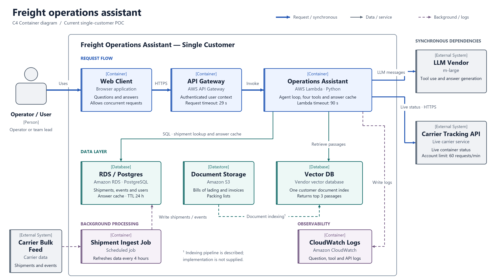
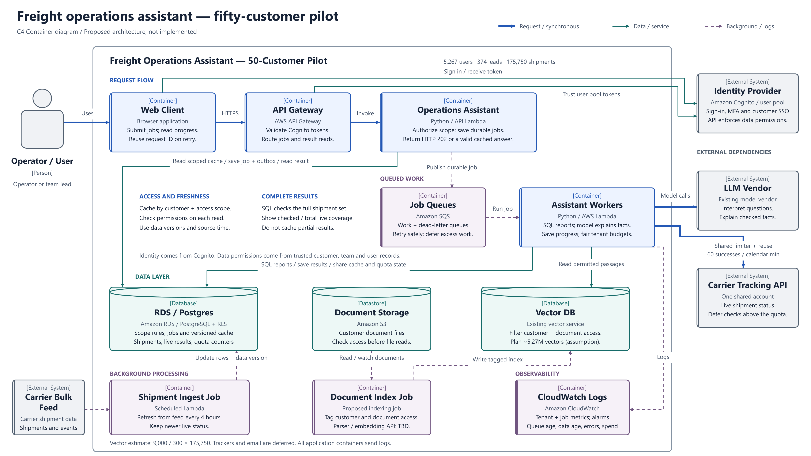
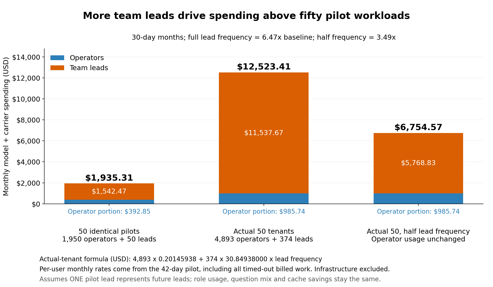
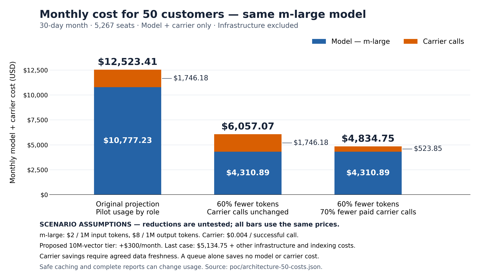

# Report

## 1. Current pilot architecture

One customer has 40 users and 300 active shipments. API Gateway calls one Lambda. The Lambda uses `m-large`, four tools, Postgres, a carrier API, and a document index over S3 files. The free feed updates shipments every four hours. The gateway limit is 29 seconds; Lambda can run for 90 seconds.

Sources: [POC](poc/README.md), [handler](poc/handler.py), [tools](poc/tools.py), [limits](costs-and-limits.md). [SVG review layout](docs/architecture/architecture-review.svg) · [Mermaid C4 source](docs/architecture/architecture-review.mmd).

## 2. Problems found in the pilot

The 42-day pilot has 1,952 questions. Portfolio questions contain “my shipments.”

| Problem | Evidence |
|---|---|
| P1: Access | The question-only cache key omits user scope. Shipment lookup, live tracking, and document search lack access filters. The [schema](poc/schema.sql) has no customer/team fields. [Cache analysis](pilot_outputs/05_cache_scope.png) infers 82 hits after another user's write; disclosure is not proved. |
| P2: Timeouts | 131 of 132 uncached lead portfolio questions time out. Median run time is 47.5 seconds, above the 29-second limit. [Timeout plot](pilot_outputs/01_timeouts.png). |
| P3: Incomplete reports | 129 runs reach the 25-step limit. Median counts: 105 listed shipments, 15 database targets, 8 successful live targets. The handler also caches capped answers. [Coverage plot](pilot_outputs/02_shipment_checks.png). |
| P4: Carrier quota | All 100 rejected attempts occur on Mondays. The busiest minute has 60 successes and 39 rejections. The shared limit is 60 successes per calendar minute. [Burst plot](pilot_outputs/03_carrier_bursts.png). |
| P5: Freshness | Answers can remain valid for 24 hours. The feed updates every four hours. 79 of 1,987 live checks differ from the database. [Freshness plot](pilot_outputs/06_freshness.png). |
| P6: Failed-work cost | Timeouts consume $36.11 of $54.19, or 66.6%. Work continues after the gateway returns 504. [Spend plot](pilot_outputs/04_spend.png). |
| P7: Vector capacity | Assume 9,000 / 300 = 30 vectors/shipment. The [roster](data/tenants.csv) exceeds the [1-million starter limit](costs-and-limits.md) in Jan 2027 at ten customers; fifty need 5.27 million. |

[Analysis limits](pilot_outputs/results.md): answer accuracy is unmeasured. Cache writes are inferred. Live checks are selected and can repeat shipments. 

## 3. Proposed architecture for fifty customers

**This is proposed, not implemented.** Keep shared API Gateway, Lambda, Postgres, S3, vector services, and the free feed. The roster totals 5,267 seats, 374 leads, and 175,750 shipments.

| Problem | Design response |
|---|---|
| P1 | Use Cognito identity and trusted customer/team/user scope in tools, jobs, document retrieval, and caches; enforce database row access. |
| P2 | Save durable jobs, return HTTP 202 with job IDs, and queue long work in SQS. |
| P3 | Use fixed SQL/code for full shipment reports; let the model explain facts; never cache partial reports as complete. |
| P4 | Enforce one shared quota, merge duplicate checks, reuse fresh results, and defer work under customer budgets. |
| P5 | Invalidate changed data, preserve newer live results during ingestion, and show source time and checked/total coverage. |
| P6 | Make retries safe, save progress, and cap time, work, and cost. |
| P7 | Size the vector tier from measured document volume; plan the 10-million-vector tier. |

A queue does not raise carrier capacity. Freshness reuse needs product agreement. Fully live reports must wait or show incomplete coverage.

Before the next customer: fix access, cache scope, complete reports, durable jobs, and the shared quota. Add backups, database failover, and capped concurrency before paid production use. Monitor cost, freshness, errors, and queue age. Then test savings and Monday load. Model interpretation and explanations remain read-only. Email and other external actions are deferred.

[Design notes](docs/architecture/architecture-50.txt) · [SVG review layout](docs/architecture/architecture-50.svg) · [Mermaid C4 source](docs/architecture/architecture-50.mmd). Recovery and capacity remain untested. Cost forecasts retain pilot usage and capped work. One lead represents future leads. Safe, complete answers can cost more.

## 4. Original cost analysis

Original: $250.47/customer, $2.38/seat. Revenue: $45,340/month at $6–$10/seat. [Model](model_outputs/results.md), [customer costs](model_outputs/tenant_costs.csv).

## 5. New cost analysis and projection

Proposed: $96.69/customer, $0.92/seat. Reductions are untested. [Calculation](scripts/plot_redesign_costs.py), [CSV](redesign_cost_outputs/fixed_model_cost_projection.csv).

Model/carrier: Oct 2026 $223.33; Jan 2027 $1,009.58; Sep 2027 $4,834.75/month. Assume all [go-live dates](data/tenants.csv), including pipeline customers, full 30-day months, and both reductions from the start.

+$300 vectors = **$5,134.75/month subtotal**. Unpriced: API/Lambda, SQS, database/failover/backups, S3, identity, hosting, logs/network, parsing/embeddings/indexing. Validate costs and savings.
